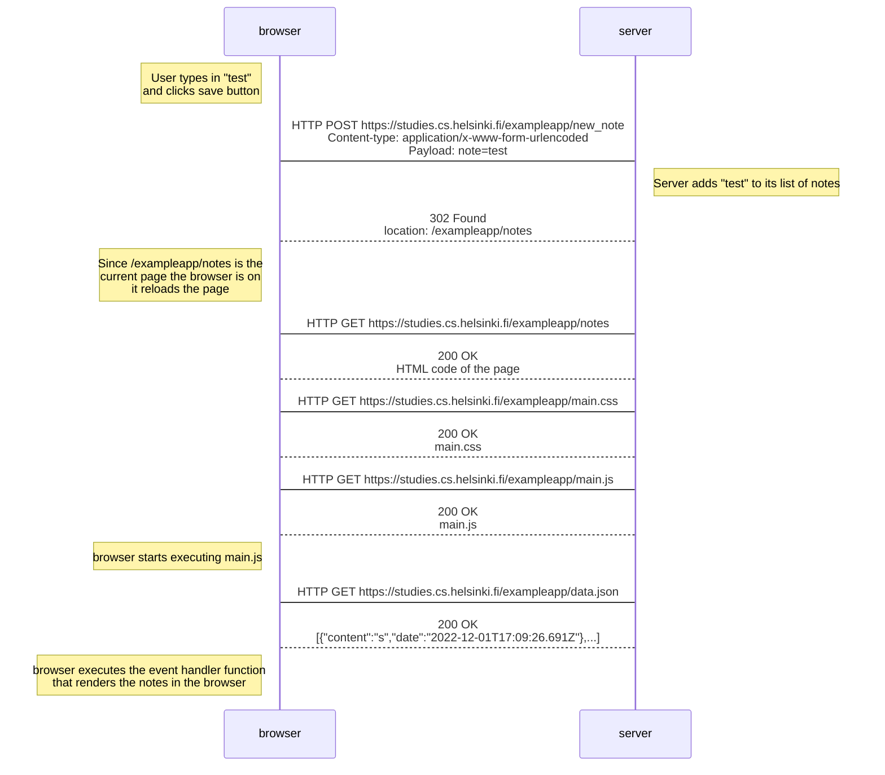

```mermaid
sequenceDiagram
Note left of browser: User types in "test" <br/> and clicks save button

browser->server: HTTP POST https://studies.cs.helsinki.fi/exampleapp/new_note <br/> Content-type: application/x-www-form-urlencoded <br/> Payload: note=test

Note right of server: Server adds "test" to its list of notes

server-->browser: 302 Found <br/> location: /exampleapp/notes

Note left of browser: Since /exampleapp/notes is the <br/> current page the browser is on <br/> it reloads the page

browser->server: HTTP GET https://studies.cs.helsinki.fi/exampleapp/notes
server-->browser: 200 OK <br/> HTML code of the page
browser->server: HTTP GET https://studies.cs.helsinki.fi/exampleapp/main.css
server-->browser: 200 OK <br/> main.css
browser->server: HTTP GET https://studies.cs.helsinki.fi/exampleapp/main.js
server-->browser: 200 OK <br/> main.js

note left of browser: browser starts executing main.js

browser->server: HTTP GET https://studies.cs.helsinki.fi/exampleapp/data.json
server-->browser:  200 OK <br/> [{"content":"s","date":"2022-12-01T17:09:26.691Z"},...]

note left of browser: browser executes the event handler function<br/>that renders the notes in the browser
```
