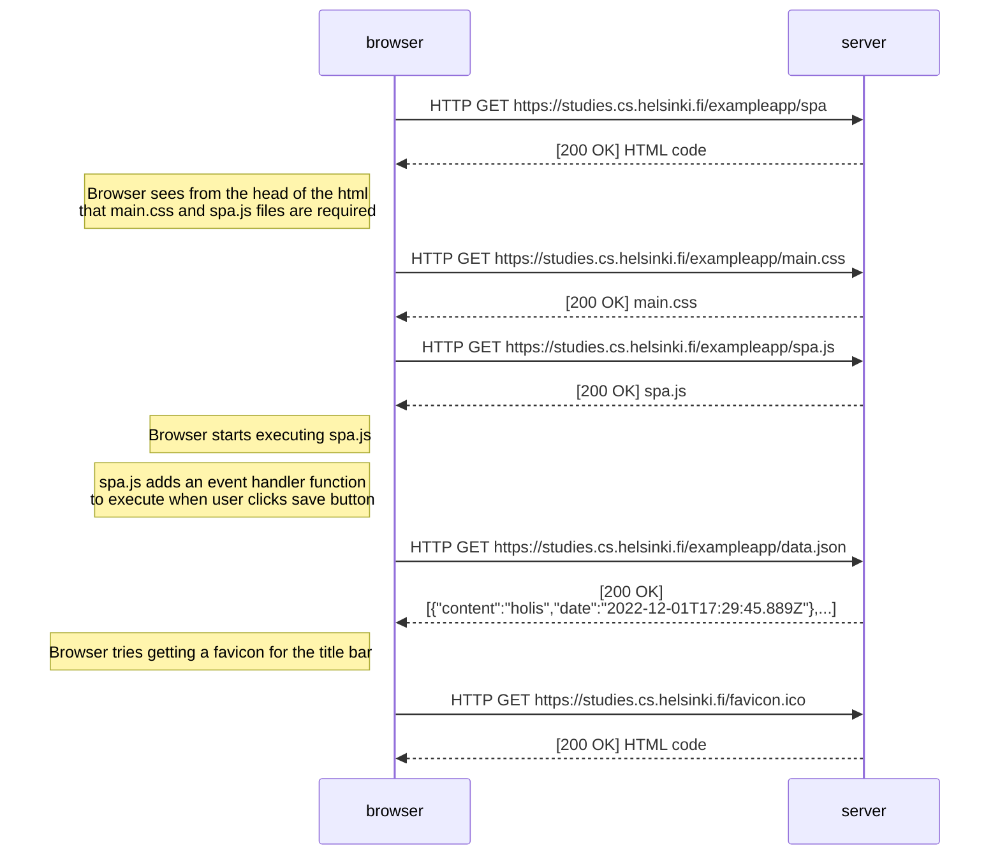

```mermaid
sequenceDiagram
browser->>server: HTTP GET https://studies.cs.helsinki.fi/exampleapp/spa
server-->>browser: [200 OK] HTML code
Note left of browser: Browser sees from the head of the html <br/> that main.css and spa.js files are required
browser->>server: HTTP GET https://studies.cs.helsinki.fi/exampleapp/main.css
server-->>browser: [200 OK] main.css
browser->>server: HTTP GET https://studies.cs.helsinki.fi/exampleapp/spa.js
server-->>browser: [200 OK] spa.js
Note left of browser: Browser starts executing spa.js

Note left of browser: spa.js adds an event handler function <br/> to execute when user clicks save button

browser->>server: HTTP GET https://studies.cs.helsinki.fi/exampleapp/data.json
server-->>browser: [200 OK]<br/>[{"content":"holis","date":"2022-12-01T17:29:45.889Z"},...]
Note left of browser: Browser tries getting a favicon for the title bar
browser->>server: HTTP GET https://studies.cs.helsinki.fi/favicon.ico
server-->>browser: [200 OK] HTML code
```
