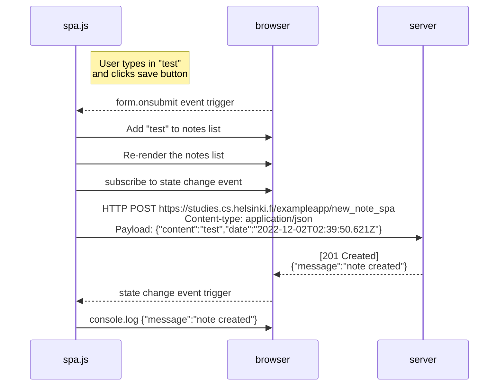

```mermaid

sequenceDiagram
Note right of spa.js: User types in "test"<br/>and clicks save button
browser-->>spa.js: form.onsubmit event trigger

spa.js->>browser: Add "test" to notes list
spa.js->>browser: Re-render the notes list
spa.js->>browser: subscribe to state change event
spa.js->>server: HTTP POST	https://studies.cs.helsinki.fi/exampleapp/new_note_spa <br/> Content-type: application/json <br/> Payload: {"content":"test","date":"2022-12-02T02:39:50.621Z"}
server-->>browser: [201 Created] <br/>{"message":"note created"}
browser-->>spa.js: state change event trigger
spa.js->>browser: console.log {"message":"note created"}
```
